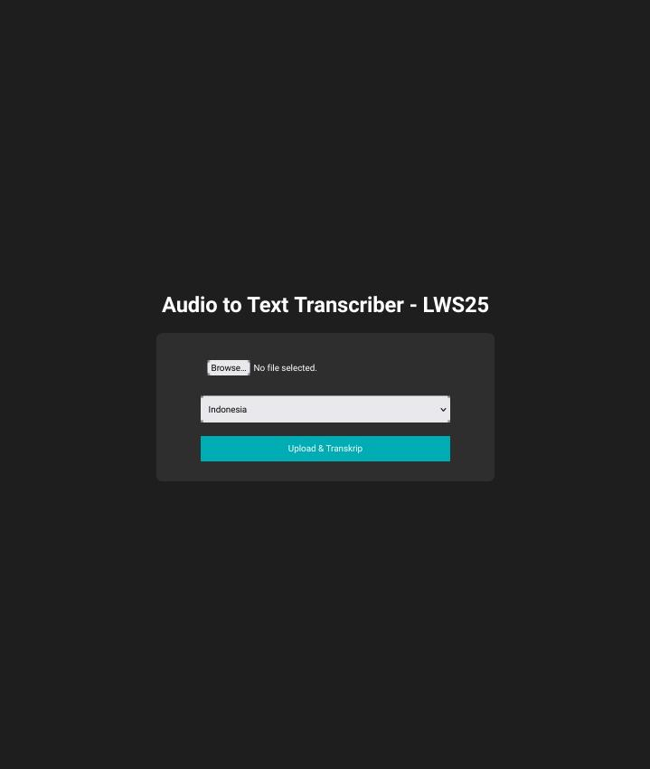

# Audio to Text Transcriber
# LWS25 🗣️➡️📝  

### 🎯 About  
Audio to Text Transcriber is part of the **Local Web Software 2025 (LWS25)** project, designed to convert audio files to text offline using Flask, SpeechRecognition, and Pydub.  

---



---

## ⚡ Features  
✅ Supports multiple languages (Indonesian, English, Japanese, Korean, Arabic)  
✅ Accurate transcription using Google Speech API  
✅ One-click copy to clipboard  
✅ Simple dark-themed UI  

---

# 🚀 Installation  
## 1. installing package 
- ### on termux
```bash
pkg install python3 git
```
- ### on linux
```bash
apt install python3 git
```
--- 

## 2. Clone the Repository  
```bash
git clone https://github.com/username/stt-py-lws25.git
```

---

## 3. install pip package
```bash
pip install -r requirements.txt
```
---
## 4. run the server
```bash
python3 app.py
```